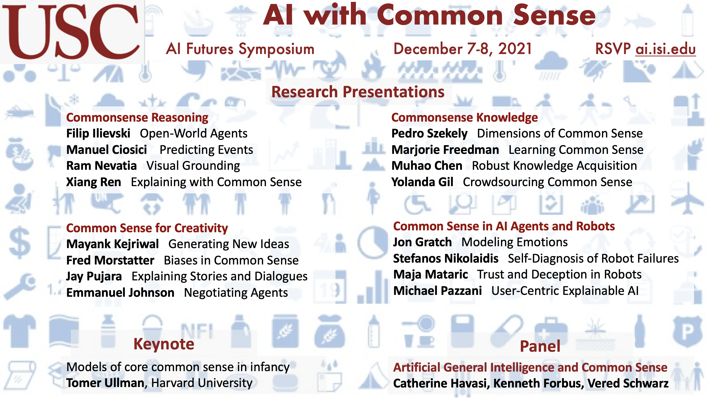

---

Humans use commonsense knowledge to understand how the world works.  AI systems still lack commonsense knowledge, which is critical in many domains in order to form expectations, manage unexpected situations, and connect with the human experience. This symposium presents an overview of research at USC on acquiring and organizing commonsense knowledge, integrating it into AI systems, and measuring its impact on improving AI system behaviors and interactions with people.

This event is part of the USC AI Futures Symposium Series. Prior events were held in May 2021 with the theme: [AI and Data Science](https://www.isi.edu/events/ai-symposium/), and in January 2021 with the theme: [Will AIs Ever Be One of Us?](https://www.isi.edu/events/ai_symposium_2021).

## Recordings

Video recordings of all the sessions are available <a href="https://www.youtube.com/playlist?list=PLknXvJJeEDaLtCMYo2-ggdfOPJKiZq89c"><b>here</b></a>.

**Individual sessions:**

* <a href="https://youtu.be/JJ2a8Eleox0">Welcome and Opening Remarks</a>

* <a href="https://youtu.be/h6sTdb1GD1g">Session I: Commonsense Reasoning</a>

* <a href="https://youtu.be/YH6mft4NcYI">Session II: Commonsense Knowledge</a>

* <a href="https://youtu.be/hbJskihE6AM">Keynote: Tomer Ullman</a>
* <a href="https://youtu.be/JJ2a8Eleox0">Session III: Common Sense Creativity</a>
* <a href="https://youtu.be/MWMV1GYzF-Y">Session IV: Common Sense in AI Agents and Robots</a>
* <a href="https://youtu.be/oyzUZGfMg20">Panel: Common Sense and AGI</a>
* <a href="https://youtu.be/WISda6eyzJI">Closing remarks</a>

## Schedule

The sessions will run from 9am PST to 12pm PST on December 7-8, 2021.

A preliminary agenda is available [here](https://isi-usc-edu.github.io/USC-CommonSense-Symposium/schedule).

## Attending

Please register [here](https://isi-usc-edu.github.io/USC-CommonSense-Symposium/register).

## Questions?

Please email any questions to **ai.isi.usc.edu@gmail.com**.

## Subscribe

Subscribe to our [USC AI Futures mailing list](https://mailman.isi.edu/mailman/listinfo/usc-ai-futures-events) to receive information about this and future events.
