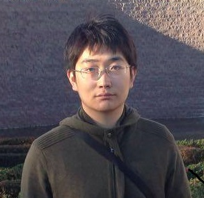

---

The sessions will run from 9am PST to 12pm PST on December 7-8, 2021.  All times below are in PST (Los Angeles time).  Links to attend the sessions will be emailed privately after [registration](https://usc.zoom.us/webinar/register/WN_2vcznEeMQsO44aYZpk8RIg).

## Tuesday December 7, 2021

| Start | End | Session |  |
| ---- | ---- | --------- | ------------------- |   
| 9:00 | 9:15 | **Welcome and Opening Remarks**  |  |
| 9:15 | 10:05 | **Session I: Common Sense Reasoning**  |  |
|  |  | *Open-world Agents*   [Filip Ilievski](https://usc-isi-i2.github.io/ilievski/)   Research Scientist, Information Sciences Institute, Viterbi School of Engineering |  |
|  |  | *Explaining with Common Sense*   [Xiang Ren](https://shanzhenren.github.io/)   Assistant Professor of Computer Science, Viterbi School of Engineering; Research Lead, Information Sciences Institute, Viterbi School of Engineering	 |  |
|  |  | *Predicting Events*   [Manuel Ciosici](https://scholar.google.com/citations?user=vseIg5YAAAAJ&hl=en)   Postdoctoral Researcher, Information Sciences Institute, Viterby School of Engineering |  |
|  |  | *Visual Grounding*   [Ram Nevatia](https://sites.usc.edu/iris-cvlab/professor-ram-nevatia/)  Professor of Computer Science and Electrical and Computer Engineering; Director, Institute for Robotics and Intelligent Systems, Viterbi School of Engineering |  |
| 10:05 | 10:15 | **Break**  |  |
| 10:15 | 11:00 | **Session II: Common Sense Knowledge**  |  |
|  |  | *Dimensions of Common Sense*   [Pedro Szekely](https://usc-isi-i2.github.io/szekely/)   Research Associate Professor of Computer Science; Principal Scientist and Director of the AI Division, Information Sciences Institute, Viterbi School of Engineering |  |
|  |  | *Learning Common Sense*   [Marjorie Freedman](https://www.isi.edu/people/mrf/about)   Research Team Lead, Information Sciences Institute, Viterbi School of Engineering |  |
|  |  | *From Data to Common Sense*   [Muhao Chen](https://muhaochen.github.io/)    Research Assistant Professor of Computer Science, Viterbi School of Engineering; Research Scientist, Information Sciences Institute, Viterbi School of Engineering |  |
|  |  | *Transferring Knowledge*   [Jon May](https://www.isi.edu/~jonmay/)   Research Assistant Professor of Computer Science, Viterbi School of Engineering; Research Lead, Information Sciences Institute, Viterbi School of Engineering |  |
| 11:00 | 11:15 | **Break**  |  |
| 11:15 | 12:00 | **Invited Talk: Title TBD**  [Tomer Ullman](https://www.tomerullman.org/)   Assistant Professor, Department of Psychology, Harvard University |  |

## Wednesday December 8, 2021

| Start | End | Session |  |
| ---- | ---- | --------- | ------------------- |   
| 9:00 | 9:45 | **Session III: Common Sense for Creativity** |  |
|  |  | *Generating New Ideas*   [Mayank Kejriwal](https://usc-isi-i2.github.io/kejriwal/)   Research Assistant Professor of Computer Science, Viterbi School of Engineering; Research Team Lead, Information Sciences Institute, Viterbi School of Engineering |  |
|  |  | *Biases in Common Sense*   [Fred Morstatter](https://isi.edu/~fredmors/)   Research Assistant Professor of Computer Science, Viterbi School of Engineering; Research Scientist, Information Sciences Institute, Viterbi School of Engineering |  |
|  |  | *Explaining Stories and Dialogues*   [Jay Pujara](https://www.jaypujara.org/)   Research Lead and Director of the Center on Knowledge Graphs, Information Sciences Institute; Research Assistant Professor of Computer Science, Viterbi School of Engineering |  |
